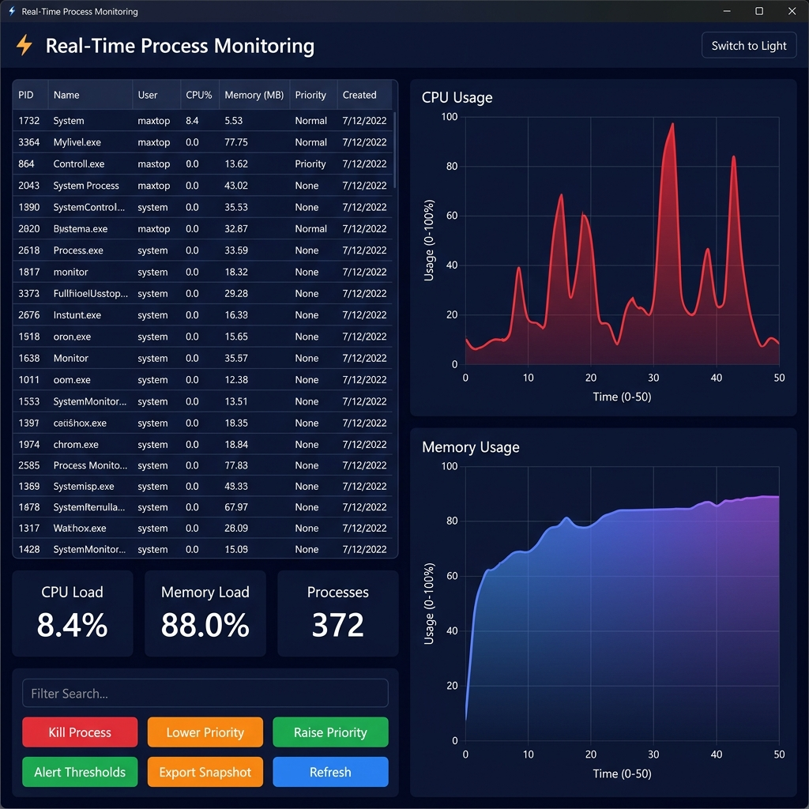

# Real-Time Process Monitoring

## Overview



Real-Time Process Monitoring is a cross-platform desktop dashboard built with **Python**, **Tkinter**, and **Matplotlib**. It displays running system processes in real time, visualizes CPU and memory trends with animated charts, and lets you react immediately — kill runaway processes, adjust priorities, export snapshots, or configure resource alerts.

## Features

- **Live process table** — PID, name, user, CPU%, memory (MB), priority, and creation time, auto-refreshed every 3 seconds.
- **Color-coded rows** — high CPU (red), medium CPU (orange), and low CPU (green) for quick visual scanning.
- **Process controls** — kill a process, raise or lower its priority, and manually refresh the table.
- **Sortable columns** — click any column header to sort ascending/descending.
- **Name filter** — instantly filter the process list by typing a process name.
- **Real-time charts** — CPU and memory utilization plotted with gradient fills and animated marker updates (Matplotlib).
- **Configurable alerts** — set CPU and memory thresholds; pop-up warnings fire with a configurable cooldown (default 45 s).
- **Export snapshot** — save the current process list to a CSV file at any location.
- **Historical logging** — every refresh cycle appends aggregate system metrics to `data/process_history.csv`.
- **Dark / Light theme** — toggle between a sleek dark mode and a clean light mode at any time.
- **Cross-platform** — works on Windows, Linux, and macOS; priority changes automatically use the correct OS-level API.

## Project Structure

```
Real-Time-Process-Monitoring/
├── app.py                # Main application (UI + logic)
├── requirements.txt      # Python dependencies
├── screenshot.png        # App screenshot for README
├── data/
│   └── process_history.csv   # Auto-generated historical log
└── README.md
```

## Prerequisites

- **Python 3.9+**
- **Tkinter** (bundled with most Python installations)

## Installation

1. Clone the repository:
   ```bash
   git clone https://github.com/<your-username>/Real-Time-Process-Monitoring.git
   cd Real-Time-Process-Monitoring
   ```

2. (Recommended) Create and activate a virtual environment:
   ```bash
   python -m venv venv
   # Windows
   venv\Scripts\activate
   # Linux / macOS
   source venv/bin/activate
   ```

3. Install dependencies:
   ```bash
   pip install -r requirements.txt
   ```

## Usage

1. Run the dashboard:
   ```bash
   python app.py
   ```
2. Use the **filter bar** to search processes by name.
3. Select a process row and use the control buttons:
   - **⚠ Kill Process** — terminate the selected process.
   - **↓ Lower Priority** / **↑ Raise Priority** — adjust scheduling priority.
   - **↻ Refresh** — manually refresh the process list.
4. Click **⬇ Export Snapshot** to save the current process table as CSV.
5. Click **⚙ Alert Thresholds** to configure CPU/memory warning limits.
6. Toggle **☀ / 🌙** in the title bar to switch between light and dark themes.

## Data & Exports

| File | Description |
|------|-------------|
| `data/process_history.csv` | Automatically appended every refresh cycle — timestamp, system CPU%, system memory%, process count, top CPU process, top memory process. |
| Manual CSV export | Use the **⬇ Export Snapshot** button to save the full process list to any location. |

## Contributing

Contributions are welcome! Fork the repo, create a feature branch, and open a pull request with a clear summary of your changes.

## License

This project is licensed under the MIT License. See the [LICENSE](LICENSE) file for details.

## Contact

For questions or feature requests, contact [Avneet Chaudhary](mailto:avneetchaudharycool9199@gmail.com).
